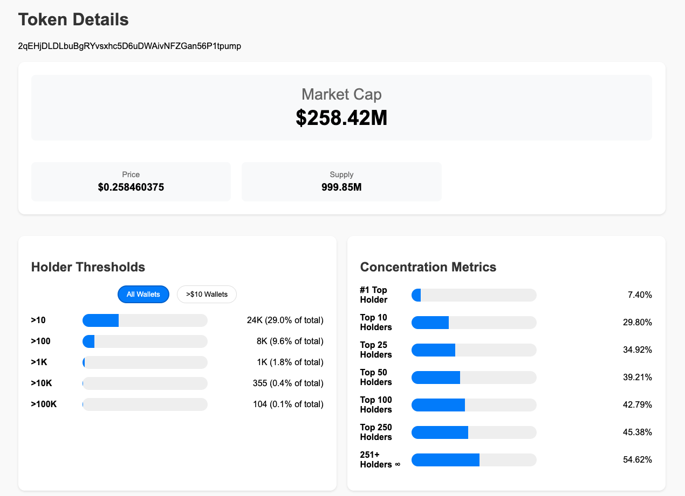
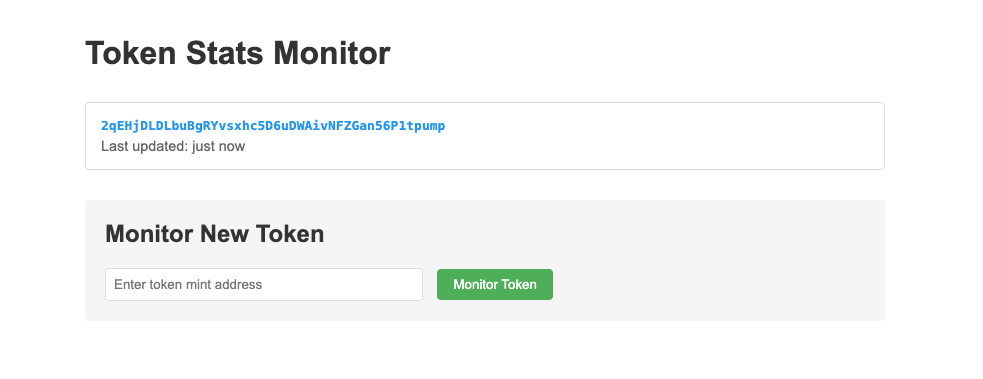

# Memespread - track holders & concentration of Solana coins in real-time with Clickhouse DB

**Memespread** helps measure with extreme precision how the supply of Solana coins is concentrated.

Often, memecoin creators of send fractions of cents to thousands of random addresses to pump up "holder" counts. Sites such as HolderScan have helped illuminate this practice, but they are slow to update data and add the latest coins. (It's a fairly data and RPC-heavy process.)

Memespread helps you DIY this process with little more than a Helius API key.


Using ClickHouse's powerful [materialized views](https://clickhouse.com/docs/materialized-views) and real-time data processing, it provides granular insights into token distribution patterns, helping you understand the true concentration dynamics of any Solana token.

## Setup

There are three ways to run Memespread:

### Option 1: Local Development (No Containers)

1. Add `.env` file with your Helius API key:

   ```
   HELIUS_API_KEY=XXXXX-xxxx-XXXX
   ```

2. Install ClickHouse (if not already installed):

   ```bash
   # On macOS
   brew install --cask clickhouse
   ```

   For more installation options, see the [ClickHouse installation docs](https://clickhouse.com/docs/install).

3. In one terminal, first start the ClickHouse DB server:

   ```bash
   clickhouse-server
   ```

4. In a second terminal, run the application in debug mode:

   ```bash
   RUSTUP=DEBUG cargo run
   ```

   The application will automatically connect to the "default" ClickHouse database and initialize all necessary tables and materialized views on startup.

### Option 2: Docker Compose

1. Add `.env` file with your Helius API key:

   ```
   HELIUS_API_KEY=XXXXX-xxxx-XXXX
   ```

2. Build and run with Docker from root:

   ```bash
   # Build the images (only needed first time or when code changes)
   bash deploy/docker/setup.sh build

   # Start the services (with logs)
   bash deploy/docker/setup.sh up

   # Or start in background
   bash deploy/docker/setup.sh up --detach
   ```

   Other useful commands:

   ```bash
   # View logs (if running detached)
   bash deploy/docker/setup.sh logs

   # Stop services
   bash deploy/docker/setup.sh down
   ```

### Option 3: Kubernetes

1. Add `.env` file with your Helius API key:

   ```
   HELIUS_API_KEY=XXXXX-xxxx-XXXX
   ```

2. Build the Docker image locally:

   ```bash
   docker build -t memespread:latest -f deploy/docker/Dockerfile .
   ```

3. Run the Kubernetes setup script:
   ```bash
   # This will create necessary secrets and configs
   bash deploy/kubernetes/setup.sh up
   ```

Note: If you're using a remote Kubernetes cluster or multiple nodes, you'll need to either:

- Push your built image to a container registry, or
- Build the image on each node that might run the container

## Usage

**Frontend Interface**: The application provides a web interface at `http://localhost:3000` where you can:

1. Monitor new tokens by entering their contract address
2. View statistics for already monitored tokens

### Adding a Token to Monitor



1. Visit `http://localhost:3000` in your browser
2. Enter a valid Solana SPL token contract address
3. The system will automatically:
   - Start monitoring the token (updates every minute)
   - Begin collecting holder and distribution data
   - Display initial stats once available (usually within 1-2 minutes)

You can verify monitoring status by querying ClickHouse directly:

```sql
SELECT * FROM monitored_tokens;
```

### Viewing Token Statistics

Once a token has been monitored for a few minutes, you'll see:

- **Concentration Metrics**: Token supply percentages owned by the largest N wallets of the coin (1, 10, 25, 50, 100, 250 holders)
- **Distribution Stats**: HHI score, distribution score, balance statistics
- **Holder Thresholds**: Breakdown of holder count by various USD value thresholds ($10, $100, $1K, $10K, $100K) of a given coin (at current market prices).
- **Token Stats**: Market cap, price, supply, decimals

These are calculated using the power of Materialized Views in Clickhouse.

### API response

Example response for a monitored coin with a few observations:

```json
{
  "concentration_metrics": [
    {
      "percentage": 3.603,
      "top_n": 1
    },
    {
      "percentage": 17.0322,
      "top_n": 10
    }
    ...
  ]
  "distribution_stats": {
    "distribution_score": 2.6685,
    "hhi": 60.0966,
    "mean_balance": 0,
    "median_balance": 0,
    "total_count": 0
  },
  "holder_thresholds": [
    {
      "holder_count": 3785,
      "mcap_per_holder": 3538528050.33,
      "pct_of_10usd": 100,
      "pct_total_holders": 50.3124,
      "slice_value_usd": 13369938.38,
      "total_holders": 7523,
      "usd_threshold": 10
    }
  ],
  "token_stats": {
    "decimals": 6,
    "market_cap": 13400937426424,
    "price": 0.013403055,
    "supply": 999842025249964
  }
}
```

## Database Management

If there's problems with the app adding data (eg an invalid mint address), you may need to hand-edit the database. There's a few methods to connect to your Clickhouse DB:

#### In-browser (recommended)

```bash
http://localhost:8123/play
```

#### Local dev: in-terminal

```bash
# Connect to ClickHouse client
clickhouse-client
```

# Docker: in-terminal

```
docker exec -it <container_name> clickhouse-client
```
